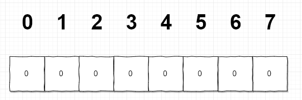
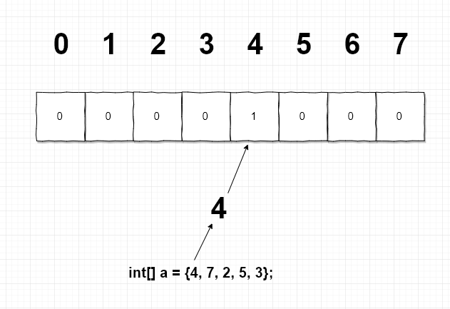
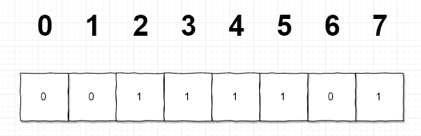

### 0. Thanks
- [海量数据处理 - 10亿个数中找出最大的10000个数（top K问题）](https://blog.csdn.net/zyq522376829/article/details/47686867)
- [从1亿个数字中取出最大的100个数字- 位图排序（空间换时间）](https://blog.csdn.net/austral/article/details/70861032)

### 1. 概述
有这样的一道题目，**给出一定范围的1亿个数据（N=<数据<=M），要求给他从小到大排序**
显然这个涉及到超大数据的排序。一般有两个套路：一个用堆排序，一个是用位图排序。这里说
一下位图排序。

### 2. 原理

位图排序其实是用数据的下标作映射到对应的数据。假如现在有一个待排序的数据：
`int[] a = {4,7,2,5,3};`

我们需要先知道这些数据的取值范围，我们看到数据是<8，那么我们初始化8个bit位的数组：


并把他们初始化为零。每一个bit位的取值是0，或者1。
然后把每一个的待排序的数字取出来，根据数字的大小把bit数组的对应下标的bit置为1.


到最后会变成这样：


然后，我们从第0未bit开始打印非0位的下标，也就是:`23457`，也就排好序了。

### 3. Java来实现一下

基本的数据类型是没有bit，最小是byte，所以我们先实现一个bit数组这样的一个数据结构：
```java
/**
 * 这里，先实现一个位数组的数据结构
 */
public static class BitArr {
    private int bitLength = 0;
    private byte[] bytes;
    public byte[] getBytes() {
        return bytes;
    }
    /**
     * 构建多少位的位数组
     * @param bitLength 位长
     */
    public BitArr(int bitLength) {
        this.bitLength = bitLength;
        bytes = new byte[(int) Math.ceil((double) bitLength/7)];
    }
    /**
     * 标记某一个位
     * 设置为1
     * @param position 位
     */
    public void mark(int position) {
        if (position>bitLength)
            return;
        int arrIndex = position/7;
        int bitIndex = position%7;
        bytes[arrIndex] |= (1 << (6-bitIndex));
    }
    public void cleanMark(int position) {
        if (position>bitLength)
            return;
        int arrIndex = position/7;
        int bitIndex = position%7;
        bytes[arrIndex] &= ~(1 << (6-bitIndex));
    }
    public void printAllBit() {
        for (byte aByte : bytes) {
            System.out.print(BitArr.Byte2String(aByte));
        }
        System.out.println();
    }
    /**
     * 打印除符号位的bit
     * @param nByte
     * @return
     */
    private static String Byte2String(byte nByte){
        StringBuilder nStr=new StringBuilder();
        for(int i=6;i>=0;i--) {
            int j=(int)nByte & (int)(Math.pow(2, (double)i));
            if(j>0){
                nStr.append("1");
            }else {
                nStr.append("0");
            }
        }
        return nStr.toString();
    }
}
```

再基于此实现算法：
```java
public static int[] bitmapSort(int[] arr, int theMax) {
    if (arr==null || arr.length==0)
        return null;
    BitArr bitArr = new BitArr(theMax+1);
    for (int anArr : arr) {
        bitArr.mark(anArr);
    }
    int[] result = new int[arr.length];
    byte[] bytes = bitArr.getBytes();
    int index = 0;
    for (int i = 0; i < bytes.length; i++) {
        for (int j = 0; j < 7; j++) {
            byte temp = (byte) (1<<6-j);
            byte b = (byte) (bytes[i] & temp);
            if ( b == temp) {
                result[index++] = i*7 + j;
            }
        }
    }
    return result;
}
```
来个验证：
```java
public static void main(String[] args) {
    int[] a = {4,7,2,5,14,3,8,12};
    int[] end = bitmapSort(a, 14);
    for (int x : end) {
        System.out.print(x+",");
    }
}
//输出
2,3,4,5,7,8,12,14,
```

有几个地方需要注意：
- java里面没有无符号的类型，所以我们只能用byte的前7位

上面写的Java实现，其实还有几个问题：
- 如果我们一开始并不知道，这堆待排序数据的取值范围怎么办？这时候可以采取动态扩充数组
- 如果待排序的数据有小于0的数据呢？

### 4.总结
位图算法，其需要一次遍历整个数据，假如有N个数据，就只是需要遍历N次，所以时间复杂度
是 `O(N)`。但是，其需要额外地开辟内存空间，有N个数据，就需要多开辟N bit位的数据，
额外需要：`N/8/1024/1024 MB` 的空间。假如是一亿个数据，那么大概要：`11.92MB`。


[代码在这里]()
